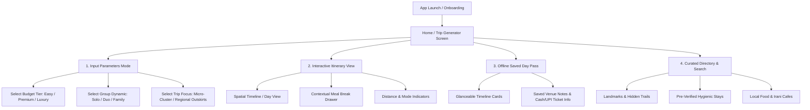

# Phase 3: Information Architecture & Taxonomy Specification

**Project Title:** Hyderabad & Telangana Hyper-Local, Budget-Intelligent Trip Planner  
**Role:** Creative Director & Product Lead (NIFT Hyderabad) | Technical Project Architect (AGY)  
**Lifecycle Stage:** Phase 3 — Information Architecture & Taxonomy

---

## 1. Executive Summary & Phase 3 Objectives

In **Phase 3**, we translate our 9 User Personas (Personas A–I) and Narrative Objectives into a clear, structured **Information Architecture (IA)**. 

Since our app's editorial tone is a **Pragmatic Utility Guide** operating on a **Mobile-First / On-the-Go** device context, the Information Architecture must prioritize:
- **Low Depth & Instant Access:** Core tasks (generating an itinerary, filtering by budget, viewing a saved day pass) completed in 2–3 taps.
- **Structured Curation Data:** Rich metadata tagging for venues, food spots, and stays to enable deterministic spatial clustering.
- **Glanceable Hierarchy:** Clear distinction between Primary Landmark Anchors, Contextual Meal Breaks, and Offline Saved Passes.

---

## 2. Proposed Mobile Sitemap & Screen Hierarchy



---

## 3. Metadata Taxonomy Schema (Data Backbone)

Each venue or item in our Hyderabad database will follow a standardized JSON metadata schema:

```json
{
  "item_id": "hyd_charminar_01",
  "name": "Charminar & Laad Bazaar Heritage Walk",
  "category": "Landmark",
  "zone": "Old_City",
  "coordinates": { "lat": 17.3616, "lng": 78.4747 },
  "budget_tiers": ["Easy", "Premium", "Luxury"],
  "group_suitability": ["Solo", "Duo", "Family"],
  "dwell_time_mins": 90,
  "opening_hours": "09:00 - 17:30",
  "closed_days": [],
  "recommended_visit_window": "08:00 - 10:30",
  "ticket_cost": {
    "indian_national_inr": 25,
    "foreign_national_inr": 300,
    "payment_modes_accepted": ["Cash", "UPI", "Card"]
  },
  "experiential_tags": ["Primary Landmark", "Heritage Architecture", "Street Photography", "Walkable"],
  "nearby_meal_radius_m": 500
}
```

---

## 4. Proposed Phase 3 UX Methods

1. **Hierarchical Sitemap & Navigation Mapping:** Structuring the mobile bottom tab bar and screen flow for friction-free operation while walking/riding.
2. **Content Inventory & JSON Metadata Taxonomy:** Defining all data attributes required for Hyderabad landmarks, food spots, and hygienic stays.
3. **Card Sorting & Categorization Logic:** Defining how users discover and filter spots (by budget, zone, or experience type).
