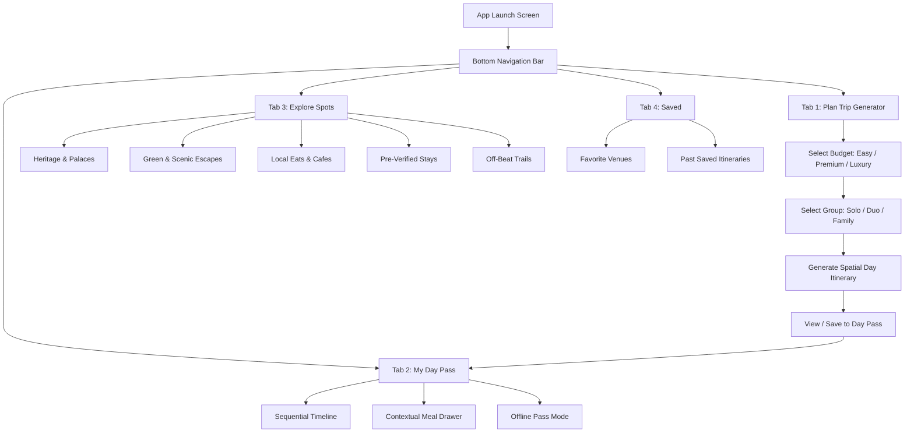

# Phase 3: Information Architecture & Taxonomy Specification

**Project Title:** Hyderabad & Telangana Hyper-Local, Budget-Intelligent Trip Planner  
**Role:** Creative Director & Product Lead (NIFT Hyderabad) | Technical Project Architect (AGY)  
**Lifecycle Stage:** Phase 3 — Information Architecture & Taxonomy (Card Sorting Edition)

---

## 1. Card Sorting Framework (Simplified Overview)

In our app, **Card Sorting** is the method of grouping every piece of content into clear, intuitive categories so travelers never feel overwhelmed. 

We have established **3 Main Sets of Cards** for the application:

```
┌────────────────────────────────────────────────────────────────────────────────────────┐
│                              THE 3 SETS OF APP CARDS                                   │
├──────────────────────────┬──────────────────────────┬──────────────────────────────────┤
│ SET 1: VENUE CARDS       │ SET 2: CATEGORY CARDS    │ SET 3: NAVIGATION CARDS          │
│ (The Content Items)      │ (The Filter Groups)      │ (The Main App Screens)           │
├──────────────────────────┼──────────────────────────┼──────────────────────────────────┤
│ • Charminar Card         │ • Heritage & Palaces     │ • Tab 1: [Plan Trip]             │
│ • Golconda Fort Card     │ • Green & Scenic Escapes │ • Tab 2: [My Day Pass]           │
│ • Irani Chai Cafe Card   │ • Local Eats & Cafes     │ • Tab 3: [Explore Spots]         │
│ • KBR Park Card          │ • Pre-Verified Stays     │ • Tab 4: [Saved]                 │
│ • Taj Falaknuma Card     │ • Off-Beat Trails        │                                  │
└──────────────────────────┴──────────────────────────┴──────────────────────────────────┘
```

---

## 2. SET 1: Venue Cards (Individual Content Items)

Every location in the app is presented as a **Venue Card** containing 6 core information components:

1. **Venue Title & Photo Header** (e.g., *Charminar & Laad Bazaar Heritage Walk*)
2. **Category Badge Tag** (e.g., `[Heritage & Palaces]`)
3. **Budget Tier Badge** (e.g., `[Easy Trip]` / `[Premium]` / `[Luxury]`)
4. **Dwell Time Estimate** (e.g., `⏱️ 1.5 Hours`)
5. **Transit Distance Indicator** (e.g., `🚶 10 min walk from previous stop`)
6. **Ticket Cost & Payment Modes Accepted** (e.g., `₹25 | Accepts UPI & Cash`)

---

## 3. SET 2: Category Filter Cards (How Places Are Grouped)

To keep browsing clean and structured, all places in Hyderabad are sorted into **5 Category Filter Cards**:

1. **`[Heritage & Palaces]`**: Monuments, historical fortresses, royal palaces, and museums (Charminar, Golconda, Chowmahalla, Salar Jung).
2. **`[Green & Scenic Escapes]`**: Nature spots, lakes, parks, and sunset hill views (KBR Park, Durgam Cheruvu, Maula Ali Hill, Ficus Garden).
3. **`[Local Eats & Cafes]`**: Authentic local food, Irani chai cafes, rooftop lounges, and fine-dining Nizami spots.
4. **`[Pre-Verified Stays]`**: Clean, hygienic hostels, boutique hotels, and 5-star resorts.
5. **`[Off-Beat Trails]`**: Hidden local alleys, artisanal craft centers, and outskirts day trips (Bhongir Fort, Pocharam Reservoir).

---

## 4. SET 3: Navigation Cards (Main App Screens)

The app is structured into **4 Primary Navigation Screens** accessible at all times via the bottom navigation bar:

1. **Tab 1: `[Plan Trip]` (Trip Generator)**
   * *Purpose:* Select Budget Tier (Easy / Premium / Luxury) and Group Type (Solo / Duo / Family) to generate a dynamic day plan.
2. **Tab 2: `[My Day Pass]` (Offline Saved Itinerary)**
   * *Purpose:* View today's step-by-step timeline, dwell times, transit durations, and nearby contextual meal options.
3. **Tab 3: `[Explore Spots]` (Category Directory)**
   * *Purpose:* Browse and search all Hyderabad venues using the 5 Category Filter Cards.
4. **Tab 4: `[Saved]` (Bookmarks & Saved Trips)**
   * *Purpose:* Access bookmarked favorite places and saved multi-day itineraries.

---

## 5. Mobile Sitemap & Navigation Flow


