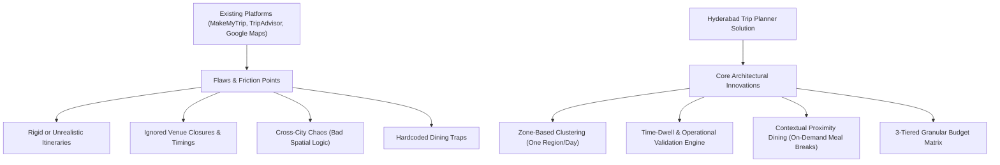

# Phase 1: Narrative & Objectives Specification

**Project Title:** Hyderabad & Telangana Hyper-Local, Budget-Intelligent Trip Planner  
**Regional Focus:** Hyderabad Metro Area & Surrounding Telangana Day-Trips  
**Target Audience:** Solo Travelers, Duos/Friends, and Families  
**Role:** Creative Director & Product Lead (NIFT Hyderabad) | Technical Project Architect (AGY)

---

## 1. Executive Summary & Product Philosophy

The **Hyderabad Hyper-Local Trip Planner** is designed to eliminate **logistical harassment and cognitive fatigue** during travel. Current market solutions (Google Maps, TripAdvisor, MakeMyTrip) provide fragmented listings without spatial logic, causing travelers to criss-cross the city, miss venue opening hours, overspend on food and transit, and experience trip burnout.

### The "Harassment-Free & Frictionless" Definition
In this platform, "Harassment-Free" extends beyond physical safety to encompass **logistical & financial friction**:
1. **Zero Wasted Transit:** Day plans are strictly clustered by geographic zone (no cross-city back-and-forth).
2. **Operational Safeguards:** Guaranteed venue opening hours, closed-day alerts, and realistic time-dwell estimates.
3. **Contextual Meal-Break Discovery:** Decoupling dining from rigid itineraries; offering nearby budget-matched food options *at the exact moment and location* of a meal break.
4. **Rest & Pace Management:** Integrated rest cushions to prevent traveler exhaustion.
5. **Strict Budget Control:** Transparent, multi-tiered cost forecasting for Stays, Entry Fees, and Dining.

---

## 2. Precedent & Competitor Audit Synthesis



### Competitor Audit Matrix

| Competitor / Platform | Strengths | Major Gaps / Failures | Our Product's Differentiating Strategy |
| :--- | :--- | :--- | :--- |
| **Google Maps** | Extensive venue data, user reviews. | No itinerary logic; causes fragmented routes; doesn't calculate total daily budget or dwell time. | **Spatial Clustering & Dwell-Time Engine:** Auto-groups nearby spots and estimates time spent per location. |
| **TripAdvisor / MakeMyTrip** | Structured data curation, package deals. | Rigid pre-packaged itineraries; pushes commercial tourist traps; hardcodes expensive restaurants. | **Contextual Meal Breaks:** Provides nearby budget-matched dining options without forcing a fixed restaurant into the schedule. |
| **Local Travel Blogs** | Rich storytelling, niche spots. | Static information; no real-time status updates; lacks personalized budget filtering. | **Dynamic Status & Budget Customization:** Filters by stays, entry fees, and dining tiers with operational status checks. |

---

## 3. Jobs-To-Be-Done (JTBD) & Value Proposition Canvas

### Core User "Job":
> *"When I travel to Hyderabad for 2–5 days with a specific budget and group (solo/duo/family), I want an accurate, realistic, and spatially organized itinerary with nearby dining choices and built-in rest time, so that I can enjoy an authentic, relaxed, and budget-smart trip without missing places or getting exhausted."*

### Budget Architecture Breakdown

```
                       ┌────────────────────────────────────────┐
                       │     3-TIER BUDGET ARCHITECTURE         │
                       └───────────────────┬────────────────────┘
                                           │
         ┌─────────────────────────────────┼────────────────────────────────┐
         ▼                                 ▼                                ▼
┌─────────────────┐               ┌─────────────────┐              ┌─────────────────┐
│ Budget-Friendly │               │    Mid-Range    │              │ Curated Luxury  │
└────────┬────────┘               └────────┬────────┘              └────────┬────────┘
         │                                 │                                │
  Sub-Categories:                   Sub-Categories:                  Sub-Categories:
  • Backpacker / Hostels            • Boutique Heritage Stays        • Luxury Star Resorts
  • Legendary Street Food           • Iconic Local Dining            • Fine-Dining & High-Teas
  • Free Parks & Public Trails      • Ticketed Heritage Walks        • Private Guided Excursions
```

#### Cost Components Tracked Per Itinerary:
1. **Stays / Accommodations:** Hostels, Boutique Stays, Luxury Resorts.
2. **Entry Tickets & Experiences:** Monument tickets, park fees, activity passes.
3. **Cafes & Dining:** Nearby contextual recommendations based on user's selected budget tier.

---

## 4. Hyper-Local Regional & Spatial Taxonomy

### Zone A: City Micro-Clusters (Relaxed, Green & Heritage Spots)
* **Green & Scenic Escapes:** KBR National Park (Jubilee Hills), Durgam Cheruvu Park & Cable Bridge walk, Ficus Garden.
* **Panoramas & Hill Trails:** Maula Ali Hill (sunset views & heritage steps).
* **Old City & Cultural Heart:** Charminar lanes, Chowmahalla Palace, Laad Bazaar, historic Irani Chai cafes.

### Zone B: Regional Telangana Day-Trips (Outskirts & Adventure)
* **Heritage Forts & Treks:** Bhongir Fort (monolithic rock fortress).
* **Nature & Waterways:** Pocharam Reservoir & Wildlife Sanctuary.
* **Geological & Speleological Excursions:** Kurnool / Belum Caves & rock formations (extended day-trip).

---

## 5. Itinerary Pacing & Meal-Break Design Logic

### The "Smart Day" Structure:
1. **Morning Anchor Spot:** High-energy or outdoor location (e.g., KBR Park / Bhongir Fort) during cool hours.
2. **Dwell Time Calculation:** Pre-set dwell buffers (e.g., 1.5 hrs for KBR Park, 3 hrs for Bhongir Fort).
3. **Contextual Meal Break:** Triggers a radius search for dining options matching the user's selected budget category (Budget/Mid-Range/Luxury) within 500m–1km of the current site.
4. **Afternoon Rest Window:** Dedicated quiet/rest buffer during peak heat hours (1:30 PM – 3:30 PM).
5. **Evening Anchor Spot:** Scenic/sunset location (e.g., Durgam Cheruvu / Maula Ali Hill / Chowmahalla).
