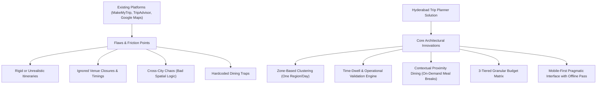

# Phase 1: Master Summary & Outputs Reference Document

**Project Title:** Hyderabad & Telangana Hyper-Local, Budget-Intelligent Trip Planner (Working Title)  
**Location / Regional Scope:** Hyderabad Metro Area & Telangana Day-Trips  
**Target Audience:** Solo Travelers, Duos/Friends, and Families  
**Primary Device Context:** **Mobile-First / On-The-Go**  
**Editorial Voice:** **Pragmatic Utility Guide**  
**Role & Team:** Creative Director & Product Lead (NIFT Hyderabad) | Technical Project Architect (AGY)  
**Document Purpose:** Central master reference for all decisions, research outputs, budget models, and technical boundaries established during Phase 1: Narrative & Objectives.

---

## 1. Executive Summary & Product Narrative

### Core Value Proposition
The platform resolves **logistical harassment and cognitive fatigue** for travelers in Hyderabad by replacing fragmented search with spatially intelligent, budget-aligned, and timing-verified itineraries.

### Re-Defining "Harassment-Free & Frictionless Travel"
In this platform, "Harassment-Free" spans both physical safety and logistical/financial friction:
1. **Zero Wasted Transit:** Spatial clustering ensures all daily activities remain within a tight geographic zone (no cross-city back-and-forth).
2. **Operational Verification:** Opening hours, closed days (e.g., Salar Jung Museum closed on Fridays), and realistic dwell-time estimates are validated.
3. **Decoupled Contextual Meal Discovery:** Restaurants/cafes are **not** hardcoded into rigid schedules. Instead, when a meal break occurs, the app surfaces nearby budget-matched dining choices near the user's current site.
4. **Pacing & Heat Rest Cushions:** Integrated afternoon rest windows (1:30 PM – 3:30 PM) to prevent physical exhaustion during hot hours.
5. **Strict Budget Control:** Transparent, multi-tiered cost forecasting for Stays, Entry Tickets, and Dining without hidden costs.

---

## 2. Product Specifications & Operational Modes

### Primary Device Context: Mobile-First / On-The-Go
* Designed for one-handed use while walking, riding transit, or taking breaks.
* High glanceability with structured UI cards.
* **Offline Saved Day Pass:** Generated day itineraries can be saved/downloaded locally (showing sequence, dwell times, ticket notes, and nearby food choices) to remain accessible even if mobile network signals drop in dense alleys or heritage basements.

### Editorial Tone: Pragmatic Utility Guide
* Direct, fluff-free, high-efficiency guidance.
* Focuses on actionable travel facts: exact timings, ticket prices, payment modes accepted, walkability, and dwell times.

### Transit & Distance Guidance Model
* Displays standardized **Distance & Duration Estimates by Mode** (Walking 🚶, Metro/Train 🚆, Car/Auto 🚗) between consecutive stops.
* Eliminates complex/unpredictable live auto-haggling or fare-calculating APIs to keep the UI clean and reliable.

---

## 3. Competitor Audit & Differentiating Strategy



### Strategic Comparison Matrix

| Competitor / Platform | Strengths | Major Gaps / Failures | Our Product's Differentiating Strategy |
| :--- | :--- | :--- | :--- |
| **Google Maps** | Extensive venue data & reviews. | No itinerary logic; causes fragmented routes; lacks total daily budget or dwell time tracking. | **Spatial Clustering & Dwell-Time Engine:** Auto-groups nearby spots into single-zone days with pre-set dwell buffers. |
| **TripAdvisor / MakeMyTrip** | Structured data curation & packages. | Rigid pre-packaged itineraries; pushes commercial tourist traps; hardcodes expensive restaurants. | **Contextual Meal Breaks:** Provides nearby budget-matched dining options on demand without forcing a fixed restaurant into the schedule. |
| **Local Travel Blogs** | Rich storytelling & niche spots. | Static information; no real-time status updates; lacks personalized budget filtering. | **Dynamic Status & Budget Customization:** Filters by stays, entry fees, and dining tiers with operational status checks. |

---

## 4. Budget Architecture & Financial Tracking

### 3-Tier Budget Model

```
                       ┌────────────────────────────────────────┐
                       │     3-TIER BUDGET ARCHITECTURE         │
                       └───────────────────┬────────────────────┘
                                           │
         ┌─────────────────────────────────┼────────────────────────────────┐
         ▼                                 ▼                                ▼
┌─────────────────┐               ┌─────────────────┐              ┌─────────────────┐
│ Budget-Friendly │               │    Mid-Range    │              │ Curated Luxury  │
└────────┬────────┘               └────────┬────────┘              └────────┬────────┘
         │                                 │                                │
  Sub-Categories:                   Sub-Categories:                  Sub-Categories:
  • Backpacker / Hostels            • Boutique Heritage Stays        • Luxury Star Resorts
  • Legendary Street Food           • Iconic Local Dining            • Fine-Dining & High-Teas
  • Free Parks & Public Trails      • Ticketed Heritage Walks        • Private Guided Excursions
```

### Cost Tracking Breakdown
1. **Stays / Accommodations:** Hostels, Boutique Stays, Luxury Resorts.
2. **Entry Tickets & Experiences:** Monument tickets, park fees, activity passes (with exact cost notes).
3. **Cafes & Dining:** Nearby contextual recommendations matching the selected budget tier.

---

## 5. Hyper-Local Regional & Spatial Taxonomy

### Zone A: City Micro-Clusters (Relaxed, Green & Heritage Spots)
* **Green & Scenic Escapes:** KBR National Park (Jubilee Hills), Durgam Cheruvu Park & Cable Bridge walk, Ficus Garden.
* **Panoramas & Hill Trails:** Maula Ali Hill (sunset views & heritage steps).
* **Old City & Cultural Heart:** Charminar lanes, Chowmahalla Palace, Laad Bazaar, historic Irani Chai cafes.

### Zone B: Regional Telangana Day-Trips (Outskirts & Adventure)
* **Heritage Forts & Treks:** Bhongir Fort (monolithic rock fortress).
* **Nature & Waterways:** Pocharam Reservoir & Wildlife Sanctuary.
* **Geological Excursions:** Kurnool / Belum Caves & rock formations (extended day-trip).

---

## 6. Technical Feasibility & Boundary Decisions

### What We ARE Building (Technical Scope):
* **Data Layer:** Structured JSON dataset for 25–30 curated Hyderabad spots + 20 food options with metadata (`zone`, `budget_tier`, `dwell_time_mins`, `closed_days`, `opening_hours`, `coordinates`).
* **Itinerary Generator:** Rule-based algorithm performing spatial clustering and dwell-time calculations.
* **Mapping Integration:** Open-source Leaflet.js / OpenStreetMap for interactive spatial rendering.
* **Offline Pass:** `localStorage` / `IndexedDB` persistence for generated day itineraries.

### What We ARE NOT Building (Scope Boundaries & Alternatives):

| Excluded Feature | Reason for Exclusion | Architectural Alternative |
| :--- | :--- | :--- |
| **In-App Payment Gateway / Vendor Ticketing** | High integration bloat, merchant compliance, and vendor maintenance. | **Transparent Fee & Payment Notes:** Display exact ticket prices, official booking URLs, and accepted payment modes (UPI / Cash / Card) so users pay via GPay/PhonePe/Cash. |
| **Live Transport Fare Haggling Engine** | Unpredictable, fluctuating pricing algorithms. | **Transit Duration Estimates:** Display clear distance/time indicators for Walking, Metro, and Car/Auto. |
| **Live CCTV Crowd Density Tracking** | Requires expensive telecom/sensor APIs. | **Static Peak Hour Guidance:** Tag venues with `recommended_visit_hours` (e.g., "Best visit: 8 AM–10 AM"). |

---

## 7. Phase 1 Milestone Approval & Lock-In

- **Status:** Phase 1 Complete & Locked ✅
- **Next Phase:** Phase 2: Empathy & User Experience Modeling
- **Git Commit Reference:** `8622771`, `8d4435a`
