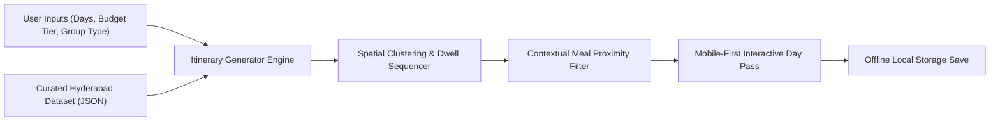

# Technical Feasibility & Architecture Reality-Check

**Project:** Hyderabad & Telangana Hyper-Local Trip Planner  
**Role:** Technical Project Architect | Creative Director & Product Lead  
**Assessment Date:** September 2026

---

## 1. Executive Verdict: Is it Possible to Build?

**YES, 100% FEASIBLE.**  
The entire vision defined in [NARRATIVE_OBJECTIVES.md](file:///c:/Users/ANKITA/Documents/Ankita_BD-24-618/NARRATIVE_OBJECTIVES.md) is technically achievable using modern web/mobile software architecture (React / Vue / HTML5, Tailwind CSS, Leaflet/Mapbox/Google Maps, and structured JSON data). 

Because we decoupled complex real-time transport APIs and live fare haggling, the app's core value rests on **superior Information Architecture (IA), curatorial data tagging, and spatial clustering logic**—all of which are completely within control.

---

## 2. Technical Feasibility Matrix

| App Feature / Concept | Technical Difficulty | Feasibility Status | Best Engineering Approach |
| :--- | :--- | :--- | :--- |
| **Zone-Based Spatial Clustering** | Low–Medium | ✅ **100% Feasible** | Assign geographic zone tags (e.g., `Old_City`, `Jubilee_Hills`, `Telangana_Outskirts`) to venues; group same-zone spots per day. |
| **Dwell Time & Day Sequencing** | Low | ✅ **100% Feasible** | Store `dwell_time_mins` metadata per venue (e.g., KBR Park: 90 mins); calculate total day timeline sequentially. |
| **3-Tier Budget Filter** | Low | ✅ **100% Feasible** | Categorize venues/food/stays with budget tags (`budget`, `mid_range`, `luxury`) and numerical cost estimates. |
| **Contextual Meal-Break Discovery** | Medium | ✅ **100% Feasible** | Calculate spatial proximity (Haversine formula or distance radius) between the current site and nearby food spots matching selected budget. |
| **Downloadable Offline Pass** | Low–Medium | ✅ **100% Feasible** | Save generated itinerary state to browser `localStorage` or `IndexedDB`; render a clean PDF or printable offline card. |
| **Distance & Transit Estimates** | Low–Medium | ✅ **100% Feasible** | Use Mapbox / OpenStreetMap / Google Distance Matrix API or static point-to-point distance matrices for key Hyderabad hubs. |

---

## 3. Potential Challenges & Risks (And How We Overcome Them)

### Challenge 1: The "Stale Data" Problem (Opening Hours & Ticket Prices)
* **The Risk:** Government monuments, parks, and local Irani cafes in India sometimes change opening hours, closed days, or ticket prices without updating websites.
* **Our Solution:** Build a robust metadata schema with explicit `last_verified_date` tags and `closed_days` arrays (e.g., Salar Jung Museum is closed on Fridays). Show clear operational disclaimer tags on venue cards.

### Challenge 2: Third-Party API Costs (Map & Distance Matrix)
* **The Risk:** Commercial mapping services (like Google Maps API) charge money per request if thousands of distance queries are made.
* **Our Solution:** For our functional prototype, we can use **Leaflet.js / OpenStreetMap** (100% free and open-source) combined with pre-computed spatial distance matrices between our curated Hyderabad clusters.

### Challenge 3: Data Curation Effort
* **The Risk:** A trip planner is only as good as its data. If venue information is incomplete, the itinerary breaks.
* **Our Solution:** Focus on a tightly curated initial dataset of **25–30 high-quality Hyderabad spots & 20 food options** across our 3 budget tiers. Quality curation > massive noisy lists.

---

## 4. What Concepts Are NOT Feasible Now (And Their Smart Alternatives)

| Concept / Speculative Idea | Why It's Problematic Now | Smart Design Alternative (Our Approach) |
| :--- | :--- | :--- |
| **Live Crowd Density Tracking** | Requires live CCTV feeds or costly Telecom/Google Popular Times APIs. | **Static Peak Hour Guidance:** Tag venues with `recommended_visit_hours` (e.g., "Best at 7:00 AM; Avoid 4:00 PM"). |
| **Live Transport Booking & Auto Fares** | Requires complex ride-hailing API partnerships and fluctuating pricing logic. | **Standard Transit Time Indicators:** Display estimated duration for Walking, Metro, and Auto/Car without handling bookings. |
| **Direct Ticket Booking & Payment Processing** | Involves payment gateway compliance (PCI-DSS), merchant accounts, and vendor contracts. | **Direct Official Ticket Links & Cash Notes:** Show official booking URLs and exact cash/UPI entrance fee amounts. |

---

## 5. Architectural Blueprint for Prototype

